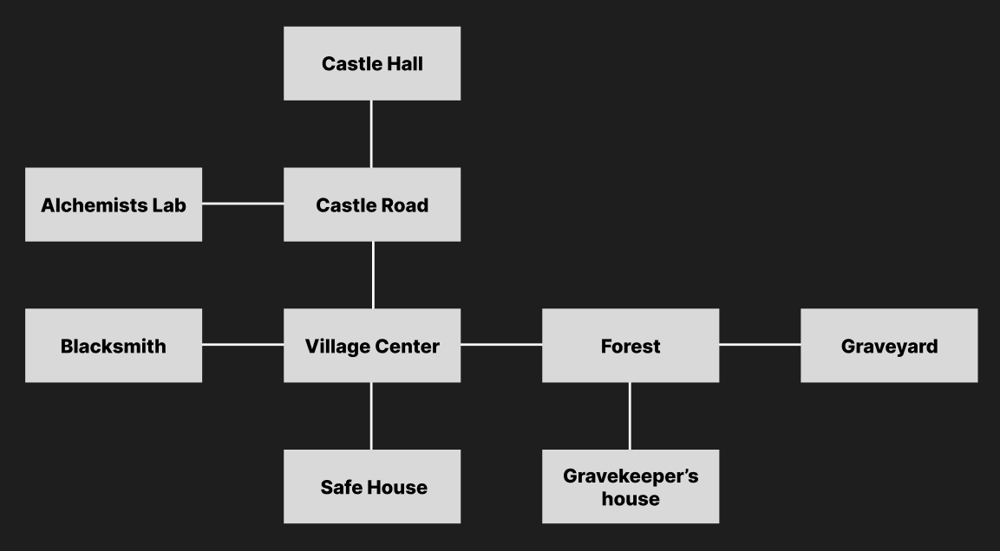

## Zork - Entrance project for the UPC Master's in Advanced Programming for AAA Video Games

It is a fully playable, text-based RPG written in C++, created as part of the entrance exam.
The player navigates through a world, engages in combat, collects gear, and progresses by defeating key enemies and unlocking new areas.
Explore a cursed village, battle undead, collect items, and defeat the necromancer to stop the rise of darkness.

---

## 🎮 How to Play

### 📜 Objective:
Defeat enemies, gather gear, and grow strong enough to enter the castle and stop the Necromancer.

### 🕹️ Commands:

| Command             | Description                                 |
|---------------------|---------------------------------------------|
| `look`              | Describes the current room and its contents |
| `go [direction]`    | Move to another room                        |
| `inventory`         | View your items                             |
| `take [item]`       | Pick up an item from the room or chest      |
| `drop [item]`       | Drop an item from your inventory            |
| `open [chest]`      | Open a chest                                |
| `place [item]`      | Place an item in a chest                    |
| `equip [item]`      | Equip a weapon or armor                     |
| `unequip [item]`    | Unequip a weapon or armor                   |
| `use [item]`        | Use a potion                                |
| `talk [npc]`        | Talk to an NPC                              |
| `attack [enemy]`    | Attack an enemy                             |
| `lock [target]`     | Lock a chest or door                        |
| `unlock [target]`   | Unlock a chest or door                      |
| `status`            | Show player status (level, health, etc)     |
| `quit`              | Exit the game                               |

### 🧾 Object Display Format

When you use the `look` command, the game displays items, NPCs, and enemies in the following format:

🔹A wooden chest. [Unlocked]   (chest)

Each line contains:

- **Description** – A short sentence describing the entity (`A wooden chest.`)
- **Status** – Additional info in brackets, such as `[Unlocked]`, `[Equipped]`, or `[Hostile]`
- **Interaction Name** – The word you type to interact with the entity (shown in parentheses)

#### 🔹 Example Commands:

open chest

talk villager

attack skeleton

---

## 🧭 Game World Map

---

## 🧩 Game Progression

1. **Start at the Safe House** – talk to the villager and gear up
2. **Gear up at the Blacksmith** *(optional but helpful)
3. **Explore the Forest** – fight skeletons, find potions
4. **Defeat the Gravekeeper (Gravekeeper's House)** – get the Graveyard key
5. **Defeat the Old King (Graveyard)** – get the legendary sword and Castle Hall key
6. **Take potions from the Alchemist Lab** *(optional but helpful)*
7. **Enter Castle Hall** – and defeat the Necromancer

Some rooms contain NPCs who offer helpful hints and guidance.

---

## 👤 Authors

- Mihail Yordanov (mialskywalker)

---

## 📎 Repository

[GitHub Repository Link](https://github.com/mialskywalker/Zork)

---

## 📜 License

This project is licensed under the MIT License.

---

## 📦 Release

The compiled release can be downloaded [here](https://github.com/mialskywalker/Zork/releases).  
Run the `.exe` (or binary) inside the ZIP to play the game.

---

## 🧱 Development Notes

This project was a great exercise in applying object-oriented programming to build a complete playable game loop in C++.

### Unique Features

- **Leveling System** - Players gain experience points from defeating enemies. Leveling up increases stats such as health, attack power and armor.
- **Drop System** - Enemies drop items upon death.
- **Level-Based Difficulty** - Combat damage is influenced by the level difference between the player and the enemies. Higher level players deal more damage and take less, while lower level players take more damage from stronger enemies.
- **Item Level Requirements** - Weapons and armor require the player to meet a minimum level before they can be equipped.
- **NPC Hints** - Friendly NPCs are placed in some areas to provide helpful information that guide the player to points of interest.

### Technical Notes

- Used dynamic_cast only where necessary, some logic relies on getType() or getItemType().
- Health Potions fully restore the player's health.
- Stamina and Strength Potions permanently increase player stats. I choose permanent effects to avoid managing temporary buffs.
- Unlock/Lock Commands - currently exits must be unlocked/locked using direction-based commands (unlock north). I would have preffered allowing players to unlock by the name of the exit or door. Chests however work by typing the name of the object (unlock chest).
- Combat - I would have preffered to separate combat into a dedicated "combat mode", but kept it inline for simplicity.
- UI - I would have preffered to have some colored text, for example, for required item level (red if player is lower level), item rarity, etc. However I wasn't sure if that could cause compatibility issues, so I left it as it is.
